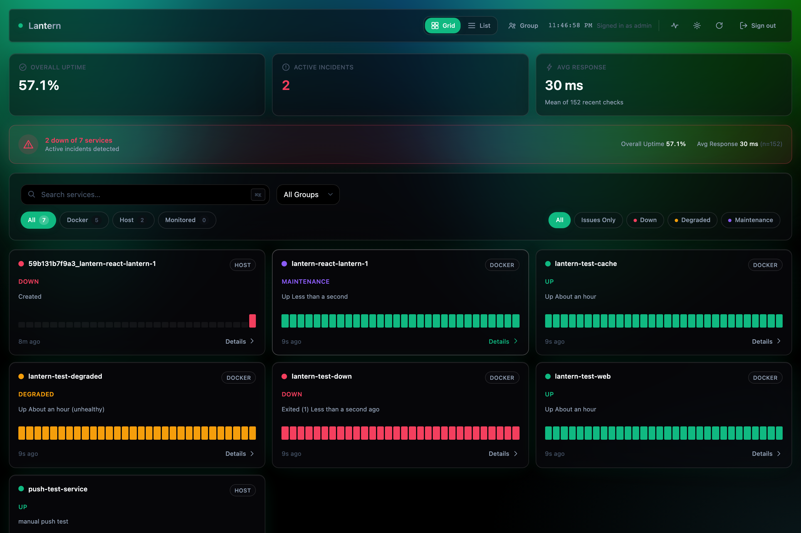
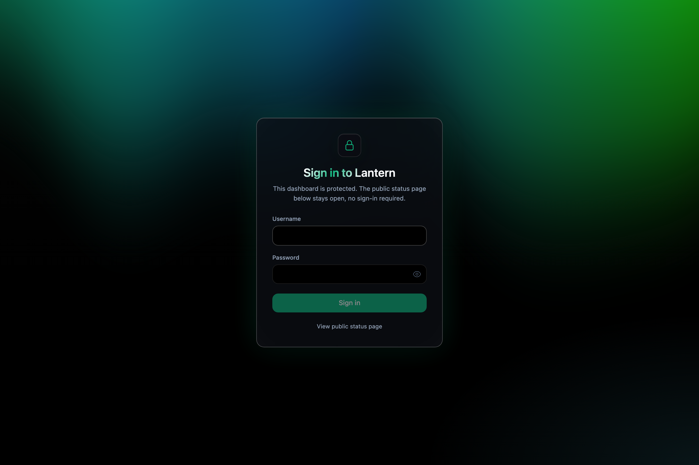
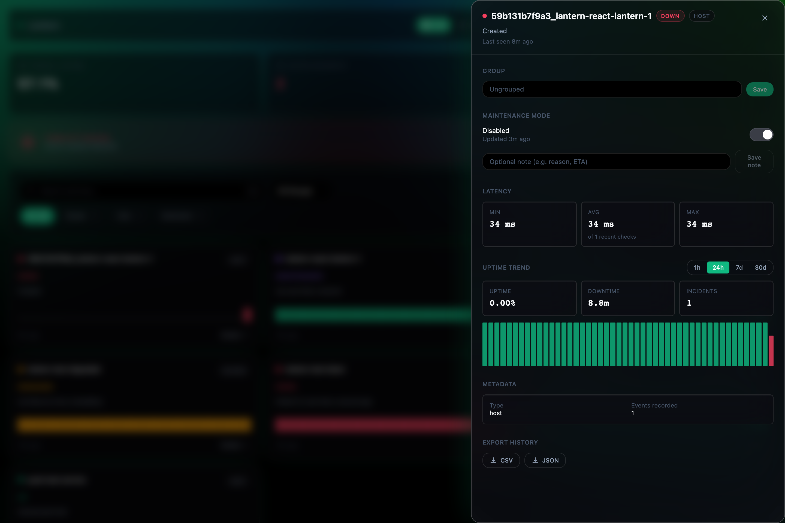
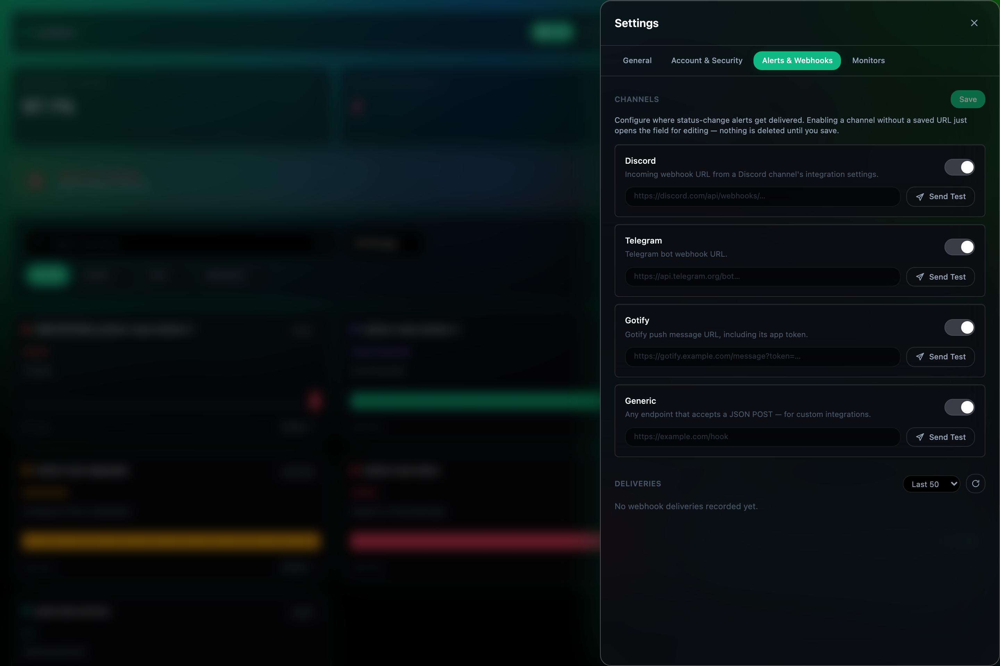
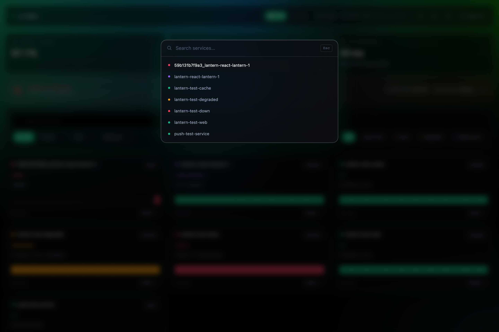
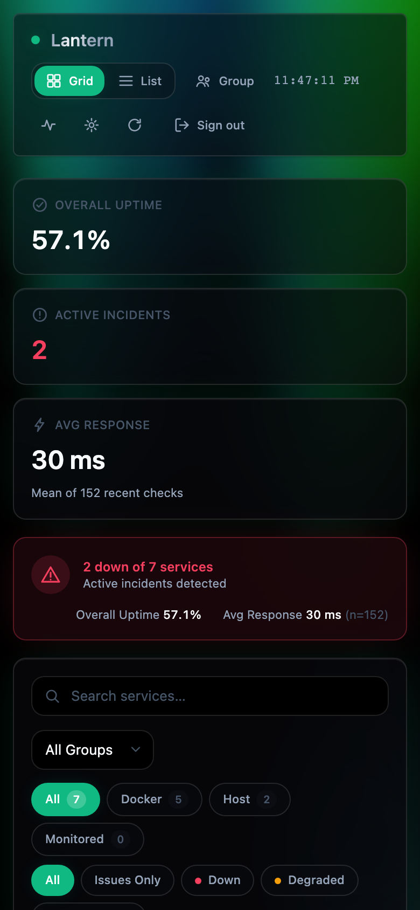

# Lantern

**Self-hosted uptime & service status dashboard.** Auto-discovers Docker containers, actively monitors HTTP/TCP/ping targets, pushes live updates over WebSocket, and alerts Discord/Telegram/Gotify/generic webhooks when something goes down.

  

> **Beta.** This is a from-scratch TypeScript/React rewrite of an earlier Go version of Lantern — functionally close to a full port, but still shaking out rough edges. Expect occasional bugs; issues and PRs welcome.



## Features

- **Docker discovery** — auto-detects containers on the host (via the Docker socket) and classifies status from their health checks, no manual config needed.
- **Active monitors** — HTTP, TCP, and ping checks on your own interval (10s–1h), with TLS certificate expiry tracking and configurable warn/critical thresholds.
- **Push status API** — services that can't be polled can push their own status in (see `push-test-service` in the demo stack).
- **Live updates** — status changes stream to every connected dashboard over WebSocket, no polling/refresh needed.
- **Webhook alerts** — Discord, Telegram, Gotify, and generic JSON-POST channels, each independently testable, with a delivery log.
- **Maintenance mode** — silence alerts and mark a service as under maintenance without losing its history.
- **Grouping, search, and filtering** — organize services into groups, filter by source/status, and jump to any service with `⌘K`.
- **Uptime trends & export** — per-service uptime/downtime/incident stats over 1h/24h/7d/30d windows, exportable as CSV or JSON.
- **Public status page** — an unauthenticated read-only view for sharing service health externally, no login required.
- **One-click DB backup** — download a consistent SQLite snapshot from the running instance.
- **Accent-themed glass UI** — a single dark "Midnight" theme with a live, animated background and a user-selectable accent color that the whole UI (including the background) follows.

## Screenshots

| | |
|---|---|
|  |  |
|  |  |



## Quick start (Docker)

The included `docker-compose.yml` builds one image that serves the API, WebSocket, and the built React app, plus four throwaway containers so Docker discovery has something to find out of the box.

```bash
git clone https://github.com/ManasvinYadav/lantern-react.git
cd lantern-react
docker compose up -d --build
```

Then open **http://localhost:7654** and sign in with the demo credentials from `docker-compose.yml` (`admin` / `changeme123` — change these before exposing the instance to anything but your own machine). Data persists in the `lantern-data` named volume.

To run just the server against your own container host (no demo services), use the `Dockerfile` directly:

```bash
docker build -t lantern .
docker run -d \
  -p 7654:7654 \
  -e LANTERN_AUTH_USER=admin \
  -e LANTERN_AUTH_PASS=changeme \
  -v lantern-data:/data \
  -v /var/run/docker.sock:/var/run/docker.sock:ro \
  lantern
```

## Configuration

All configuration is environment variables — there's no config file.

| Variable | Default | Description |
|---|---|---|
| `LANTERN_PORT` | `7654` | HTTP/WS listen port. |
| `LANTERN_DB_PATH` | `/data/lantern.db` | SQLite database file path. |
| `LANTERN_RETENTION_DAYS` | `30` | How long heartbeat/history rows are kept. |
| `LANTERN_AUTH_USER` | *(unset)* | Dashboard username. Auth is disabled entirely if unset — only do this behind your own network boundary. |
| `LANTERN_AUTH_PASS` | *(unset)* | Dashboard password. |
| `LANTERN_AUTH_TOKEN` | *(unset)* | Optional bearer token for API/push clients, independent of the session login. |
| `LANTERN_DOCKER_DISCOVERY` | `true` | Set `false` to disable Docker socket discovery entirely. |
| `LANTERN_DOCKER_POLL_SECONDS` | `60` | Docker discovery poll interval (floored at 10). |
| `LANTERN_CERT_WARN_DAYS` | `30` | TLS cert expiry warning threshold. |
| `LANTERN_CERT_CRITICAL_DAYS` | `7` | TLS cert expiry critical threshold. |
| `LANTERN_STALE_HOURS` | `24` | Hours after which a service with no heartbeat is considered stale. |
| `LANTERN_FRAME_ANCESTORS` | *(unset)* | CSP `frame-ancestors` value, for embedding the dashboard in an iframe. |
| `LANTERN_WS_ALLOWED_ORIGINS` | *(unset)* | Comma-separated allowlist of origins permitted to open the WebSocket. |

## Local development

Requires Node 22+. This is an npm workspaces monorepo (`server/`, `client/`).

```bash
npm install

# Terminal 1 — API + WebSocket on :7654
npm run dev -w server

# Terminal 2 — Vite dev server on :5173, proxying /api and /ws to :7654
npm run dev -w client
```

Open **http://localhost:5173** during development. To build both for production the way the Docker image does:

```bash
npm run build -w server
npm run build -w client
```

## Architecture

- **`server/`** — Fastify 5 + better-sqlite3, TypeScript. REST API, WebSocket hub, Docker discovery, the monitor scheduler, and the webhook dispatcher.
- **`client/`** — React 19 + Vite + Tailwind CSS v4, TypeScript. Talks to the server over REST and a WebSocket for live status pushes; renders its animated background with WebGL (`ogl`).
- **Single deployable image** — the production `Dockerfile` builds both workspaces and serves the built client as static assets from the same Fastify process that serves the API, so there's one container and one port.

## Known limitations

- Per-service alert routing (choosing which webhook channel gets which service's alerts) has a database table but no UI yet — today, every configured channel receives every alert.
- Single-tenant, single dashboard-account design — there's no multi-user support.

## Acknowledgements

Lantern started as a self-hosted status dashboard written in Go; this repository is a full rewrite onto a Node/TypeScript + React stack, aiming for feature parity with the original while modernizing the UI.
